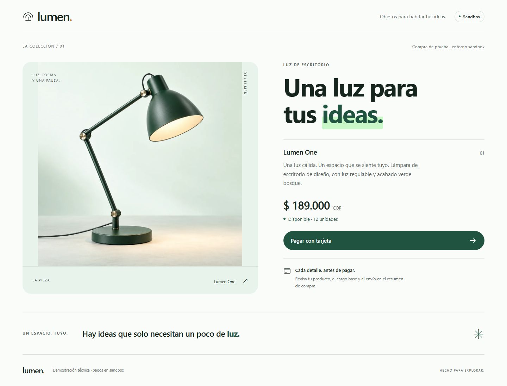
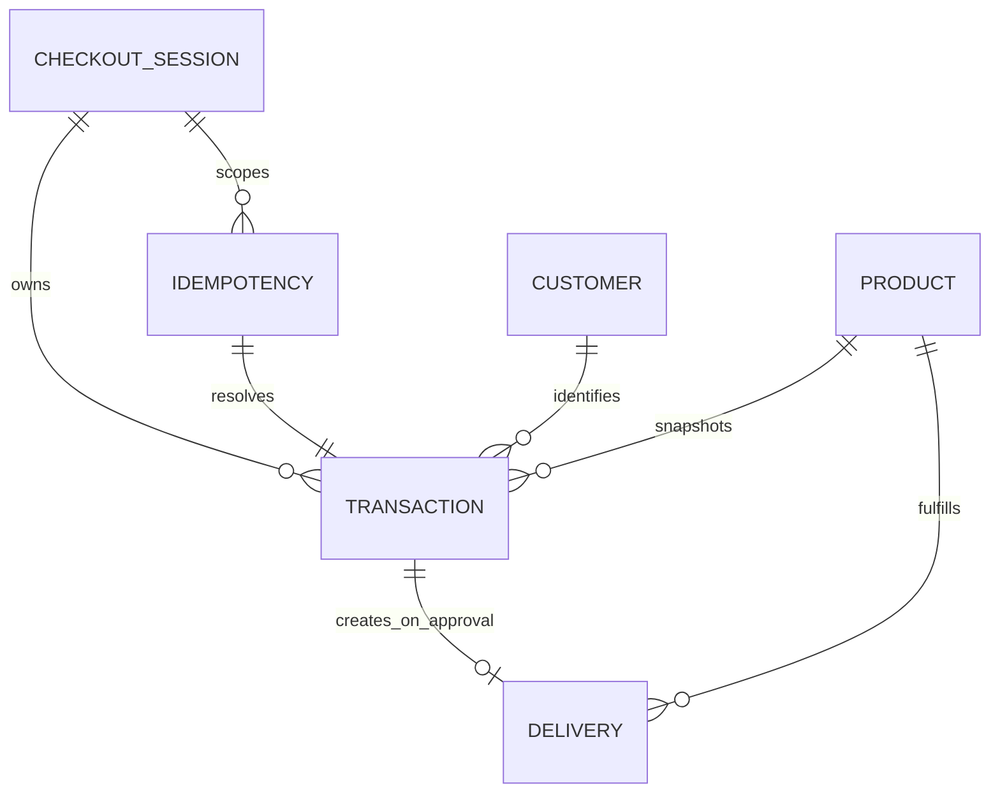

# Lumen Checkout

An original mobile-first checkout built with React, Redux Toolkit and a NestJS API. The Spanish interface sells one fictional Lumen One lamp through a five-step card-payment flow. The backend controls money, inventory and payment state. Sensitive card fields remain ephemeral in the browser and are tokenized directly by the sandbox provider.

**Verified locally:** 65 backend Jest tests, 82 frontend Jest tests and 55 independent Playwright executions pass. **Release checks still open:** a genuine sandbox payment, the public AWS deployment and its live API documentation. The assessment's UAT sandbox fails TLS trust validation from the inspected integration environment; no certificate bypass or simulated payment is presented as a real payment.

| Resource | Location / status |
| --- | --- |
| Public source | [asantiago2809/lumen-checkout](https://github.com/asantiago2809/lumen-checkout) |
| Local application | [localhost:5173](http://localhost:5173) after starting development |
| Local Swagger | [localhost:3001/api/docs](http://localhost:3001/api/docs) |
| Local OpenAPI JSON | [localhost:3001/api/docs-json](http://localhost:3001/api/docs-json) |
| Public application / Swagger | Infrastructure created; API blocked on runtime configuration. [Release evidence](docs/quality/release-report.md) records the provisional endpoint and exact limits |
| Remote CI | [Linux quality gates passed](https://github.com/asantiago2809/lumen-checkout/actions/runs/35933599708) on code/infrastructure commit `f84fc56` |



[Mobile preview](tests/e2e/evidence/product-mobile.png) · [Checkout summary](tests/e2e/evidence/summary-mobile.png) · [Evidence boundaries](tests/e2e/evidence/README.md)

## Run from a fresh checkout

Requirements: **Node.js 22.12 or newer**, npm and Git. No Docker or AWS account is needed for local development and deterministic tests. Keep ports 5173 and 3001 available.

```sh
git clone https://github.com/asantiago2809/lumen-checkout.git
cd lumen-checkout
npm ci
```

Create the API environment file if it does not already exist, then generate a session secret only when its value is blank. These commands work in PowerShell and a POSIX shell, preserve existing credentials and do not print the generated secret.

```sh
node -e "const fs=require('node:fs');if(!fs.existsSync('apps/api/.env'))fs.copyFileSync('apps/api/.env.example','apps/api/.env');"
node -e "const fs=require('node:fs'),p='apps/api/.env',s=fs.readFileSync(p,'utf8');fs.writeFileSync(p,s.replace(/^SESSION_SECRET=[ \t]*\r?$/m,'SESSION_SECRET='+require('node:crypto').randomBytes(32).toString('hex')));"
```

Edit the ignored `apps/api/.env` locally to supply matching **sandbox** credentials. Leave missing secrets blank until available; the application reports payment unavailability instead of switching to a fake gateway. The web application needs no private environment variables.

```sh
npm run dev
```

Vite starts on port 5173 and the API on port 3001. Vite proxies `/api` to the backend so browser requests and cookies use one origin. The API compiles before starting; its development watch preserves the decorator metadata used by Nest validation and OpenAPI. The product is seeded automatically. Restarting does not reset existing inventory.

### Configuration

The complete template is [apps/api/.env.example](apps/api/.env.example).

| Variable | Purpose |
| --- | --- |
| `PORT` | Local API port; default `3001` |
| `STORE_DRIVER` | `file` for one-process local development; `dynamodb` for deployment |
| `LOCAL_DATA_PATH` | Local persistent file; default `.data/checkout.json` relative to the API working directory |
| `ALLOWED_ORIGINS` | Exact browser origins separated by commas; local defaults include `http://localhost:5173` |
| `SESSION_SECRET` | Random server-only secret; production requires at least 32 characters |
| `PAYMENT_API_URL` | Allowlisted sandbox URL paired with credentials for that environment |
| `PAYMENT_PUBLIC_KEY` | Merchant public key; only this key reaches the browser at runtime |
| `PAYMENT_PRIVATE_KEY` | Server-only transaction creation and lookup credential |
| `PAYMENT_INTEGRITY_SECRET` | Server-only payment integrity signing secret |
| `PAYMENT_EVENTS_SECRET` | Reserved for a future signed webhook; no webhook is currently implemented |
| `AWS_REGION`, `DYNAMODB_TABLE` | AWS persistence configuration |
| `PAYMENT_SECRET_PARAMETER` | Optional SSM SecureString JSON parameter loaded by Lambda |

The UAT sandbox is `https://api-sandbox.co.uat.wompi.dev/v1`; the public sandbox is `https://sandbox.wompi.co/v1`. Their key families differ and cannot be exchanged. Production endpoints and mismatched key families are rejected. The source assessment, shared account details, private keys and completed `.env` are absent from the repository.

Use only [documented sandbox test data](https://docs.wompi.co/docs/colombia/datos-de-prueba-en-sandbox/) with a working, matching sandbox configuration. The current UAT TLS issue means an actual provider approval or decline has not yet been certified here.

## Checkout behavior

1. **Product:** show description, price and available units from the API.
2. **Card and delivery modal:** validate card structure, identify its brand, collect contact/delivery details and obtain explicit acceptance of both provider policies.
3. **Summary backdrop:** review product, base fee, delivery fee, total and masked card information before paying.
4. **Result:** first persist a `PENDING` transaction, then submit its payment once. Show the confirmed result or pending confirmation truthfully.
5. **Return to product:** clear the completed draft and fetch current stock.

The initial product costs **COP 189,000**, with a **COP 2,500 base fee** on every order and **COP 12,000 delivery fee**, for **COP 203,500**. Internally these are integer centavos: `18_900_000 + 250_000 + 1_200_000 = 20_350_000`. The server recalculates each quote and transaction. The client's expected total is a comparison value, never the charged amount. Each order contains one product unit; card installments can be selected from 1 to 36.

Redux manages checkout state and API effects. Only non-sensitive progress pointers persist in the browser. Contact and delivery drafts live on the server under an HttpOnly session. Refresh restores the draft or existing transaction; card fields and full tokens are never restored. Once submission starts, refresh checks the existing transaction instead of initiating another charge.

### Inventory and payment correctness

Inventory separates physical unsold units, reservations and units available to new buyers: `stockOnHand = stockAvailable + stockReserved`.

Creating `PENDING` reserves one unit atomically. **Only a verified `APPROVED` result consumes physical stock and creates a delivery.** A decline, definitive failure or pre-payment cancellation releases the reservation without a delivery. This resolves the assessment's ambiguous ordering of stock updates after successful or failed payments: an unpaid order must not consume goods.

| Example, starting with 12 units | Available | Reserved | Physical unsold |
| --- | ---: | ---: | ---: |
| Before purchase | 12 | 0 | 12 |
| PENDING reservation | 11 | 1 | 12 |
| After approval | 11 | 0 | 11 |
| After decline instead | 12 | 0 | 12 |

A session-scoped idempotency key prevents duplicate transaction creation; reusing it with different data returns a conflict. Conditional writes prevent two buyers reserving the last unit. A separate durable submission claim prevents duplicate `/pay` calls from sending another charge. Repeated finalization creates at most one delivery and one inventory decrement.

Financial status is `PENDING`, `APPROVED`, `DECLINED`, `ERROR` or `VOIDED`. Submission status is separately `NOT_STARTED`, `CLAIMED`, `SUBMITTED` or `UNKNOWN`. A timeout after submission stays **PENDING/UNKNOWN**, retaining the reservation. When an external ID exists, backend lookups verify the reference, amount and currency before applying a result.

## Architecture and data model

The backend follows hexagonal dependency direction: HTTP controllers call use cases, which depend on domain types and ports. File storage, DynamoDB and the provider HTTP client implement those ports. The domain does not import Nest, AWS or HTTP libraries. Use cases return explicit `Result` values; ROP composition stops invalid paths before side effects, while the HTTP boundary maps errors to status codes.

The React SPA uses Redux Toolkit, CSS tokens, Grid/Flex and accessible shared controls. The fictional product artwork is original: responsive WebP variants are approximately **12 KB at 640px** and **31 KB at 1200px**, with a local SVG fallback and no external font dependency. See the [design specification](docs/design.md) and [asset provenance](docs/design-assets.md).



| Entity | Persisted information and constraints |
| --- | --- |
| Product | Description, price, currency, image metadata and three inventory counters; seeded idempotently |
| Customer | Contact snapshot for an attempt, owner session and creation time; no public user directory |
| Transaction | Customer reference, immutable product/address/amount snapshots, unique payment reference, statuses, provider ID when known, reservation expiry, masked card metadata and delivery reference |
| Delivery | Transaction, product, customer and address; created only on approval, once per transaction |
| Checkout session | Hashed session identifier, CSRF material, draft, active transaction pointer and 24-hour expiry |
| Idempotency record | Session/request key, canonical request hash and resulting transaction ID |

These are logical references enforced by application rules and atomic writes, not SQL foreign keys. A contact snapshot is created per transaction attempt. No entity contains PAN, CVC or a full card token.

DynamoDB uses string `pk`/`sk` keys and an incrementing `version` for conditional writes. Products use `pk=CATALOG`, `sk=PRODUCT#id`; other entities use typed keys and `sk=META`. The `pending-index` GSI uses `gsi1pk`/`gsi1sk`, projection `ALL`. The `expiresAt` TTL applies only to sessions and never releases payment inventory. `TransactWriteItems` makes creation and finalization atomic across related records.

The local file adapter uses a process mutex, expected-version checks and atomic file replacement. It is **single-process development storage**, not a Lambda or distributed persistence solution. [Architecture decisions](docs/architecture/decisions.md) explain the tradeoffs.

### Repository map

```text
apps/web/src/                  React views, Redux, validation, API client, CSS
apps/web/public/               Original optimized artwork
apps/api/src/domain/           Money, entities, invariants and Result/ROP
apps/api/src/application/      Use cases and ports
apps/api/src/infrastructure/   HTTP, payment and persistence adapters
apps/api/src/bootstrap/        Nest composition, SSM loader, Lambda lifecycle
apps/api/test/                 Jest business, HTTP, adapter and runtime tests
tests/e2e/                    Independent HTTP/browser test harness
infra/                        AWS infrastructure and deployment procedure
scripts/                      Packaging and secret checks
docs/                         Contracts, design, role prompts and audits
```

## API reference

All routes below have prefix `/api`. Success uses `{ "data": ... }`; errors use `{ "error": { "code", "message", "fields"?, "requestId"? } }`. Session and transaction responses are not cached. The [API contract](docs/architecture/api-contract.md) includes full payloads and recovery behavior.

| Method and path | Purpose |
| --- | --- |
| `GET /health` | Readiness without configuration disclosure |
| `GET /products`, `GET /products/:id` | Seeded product and available stock |
| `GET /checkout/config` | Public sandbox key and current consent policies |
| `POST /checkout/session`, `GET /checkout/session` | Start or restore a session |
| `PUT /checkout/draft`, `DELETE /checkout/draft` | Save a non-card draft or clear/cancel an eligible draft |
| `POST /checkout/quote` | Server-calculated price breakdown |
| `POST /transactions` | Reserve stock and create PENDING with `Idempotency-Key` |
| `POST /transactions/:id/pay` | Submit the existing transaction once |
| `GET /transactions/:id` | Authorized result lookup and reconciliation |
| `GET /customers/:id`, `GET /deliveries/:id` | Owner-authorized entity reads |
| `GET /docs`, `GET /docs-json` | Swagger and OpenAPI |

In local Swagger, first call `POST /checkout/session` with `{}`. The browser receives the HttpOnly cookie. Copy the returned CSRF token into Swagger's `csrf` authorization field for writes. Supply a UUID `Idempotency-Key` for each new purchase and retain it when retrying that attempt. A payment decline is a business result, not an HTTP 500.

## Security controls

- Card data goes directly from browser memory to the provider's sandbox tokenization endpoint. It is excluded from Redux, browser storage, our API, logs and database.
- Session ownership protects transaction/customer/delivery reads. Cookies are HttpOnly and SameSite=Lax, with Secure in production. Writes require an allowed Origin and session-bound CSRF token.
- Strict nested DTOs reject unknown fields, card fields and forged statuses. Body limits, request limits and sanitized errors reduce exposure.
- The server signs immutable amounts and uses the private key for transaction creation/lookups. Only the public merchant key reaches the SPA.
- Helmet supplies API headers. Deployment verification must separately confirm public HTTPS, headers, secret retrieval and IAM behavior.
- `npm run check:secrets` scans project content. The [security review](docs/quality/security-review.md) records scope and remaining checks; no PCI or other certification is claimed.

## Tests and evidence

Recorded on **23 September 2026** from actual local executions after final formatting. Applications are measured independently.

| Jest application | Passing tests | Statements | Branches | Functions | Lines |
| --- | ---: | ---: | ---: | ---: | ---: |
| API | 65 | 98.21% | 95.02% | 96.90% | 98.21% |
| Web | 82 | 96.10% | 95.27% | 95.23% | 97.20% |

API coverage excludes only two thin process entrypoints. SSM loading and Lambda initialization/cache live in tested modules. Web exclusions cover test support and type-only declarations. Business rules, use cases, reducers and payment/HTTP adapters remain in scope.

```sh
npm run check:secrets
npm run typecheck
npm run test:coverage
npm run build
```

Reports are generated under each application's `coverage/`, including `coverage-summary.json` and `lcov.info`. The [quality workflow](.github/workflows/quality.yml) runs clean installation, secret scanning, type checks, Jest coverage, static-handler tests, builds and the complete independent browser suite, uploading coverage and E2E artifacts. Both the [initial Linux run](https://github.com/asantiago2809/lumen-checkout/actions/runs/35932314066) and the [updated code/infrastructure run](https://github.com/asantiago2809/lumen-checkout/actions/runs/35933599708) passed all gates; the latter tests `f84fc56` with the final formatted source and alternative HTTPS infrastructure.

Independent Playwright verification passed **55 executions: 11 API scenarios plus 11 browser scenarios across four projects**, with zero failures, skips or flaky outcomes in the recorded run. Projects cover Chromium desktop, Chromium at the iPhone SE CSS viewport of 375×667, Firefox and WebKit. Scenarios include approval/decline, repeated submission, stock, refresh, unknown outcomes, provider unavailability, long content, focus, keyboard use and automated accessibility checks. Additional layouts exercise 320px, portrait/landscape mobile and tablet sizes.

```sh
npx playwright install chromium firefox webkit
npm run build -w apps/api
npm run test:e2e
```

On Linux without browser system libraries, use Playwright's `install --with-deps` option. E2E starts its own SPA on **5174** and real Nest API on **3002**, with an isolated temporary persistent database. It injects a controlled payment gateway and intercepts tokenization, without contacting the provider or altering the development database. Results appear in `test-results/e2e-results.json`, with sanitized scenario screenshots. These application tests do **not** certify an external sandbox payment.

The [QA plan](docs/quality/qa-plan.md), [execution report](docs/quality/qa-report.md), [design checklist](docs/quality/design-checklist.md) and [final requirement audit](docs/quality/final-audit.md) distinguish test levels and unresolved release gates.

## Deployment and known limits

[AWS infrastructure](infra/template.yaml), [packaging](scripts/package-api.ps1) and the [deployment runbook](infra/README.md) describe persistence, secret configuration, deployment and rollback. Production uses DynamoDB and a server-only SSM secret allowlist. Packaging preserves Nest metadata and Swagger assets. The [release report](docs/quality/release-report.md) records successful HTTPS static delivery and a live DynamoDB adapter probe, plus the runtime-configuration block that still prevents public API initialization. The default route uses API Gateway HTTPS; the optional CDN requires AWS account verification.

1. **UAT TLS blocks real-payment evidence.** The sandbox resolves DNS but fails certificate-chain validation from the inspected environment. TLS checks stay enabled. The public sandbox requires its own authorized credentials and a new integration run.
2. **No webhook endpoint or scheduled reconciliation worker is implemented.** Status reconciles on authenticated transaction reads. Unsubmitted reservations expire after 15 minutes and are released atomically during relevant product/quote/transaction reads.
3. **An uncertain submission without an external ID needs operational reconciliation.** No verified reference-search mechanism is assumed. The application retains the reservation and does not blindly resubmit the payment.
4. **Rate counters are per process.** A larger deployment should add an edge or shared quota; file persistence remains local-only.
5. **Cloud and public Swagger need their own evidence.** Local and hosted CI tests do not certify provider availability, IAM, DNS or deployment behavior.

## Traceability and AI-assisted development

The coordinated workbench separates implementation from independent review. Executable tests, recorded decisions and genuine incremental commits provide the evidence; reusable prompts make the process inspectable.

- [Operating agreement](AGENTS.md), [team/handoffs](docs/team/README.md), [director](docs/team/director.md) and [delivery plan](docs/team/plan.md).
- [Backend](docs/team/backend-developer.md), [frontend](docs/team/frontend-developer.md), [designer](docs/team/designer.md), [QA](docs/team/qa-engineer.md), [design QA](docs/team/design-qa.md), [security](docs/team/security-reviewer.md), [release](docs/team/release-engineer.md) and [auditor](docs/team/auditor.md) prompts.
- [82-control requirements matrix](docs/requirements.md), [architecture](docs/architecture/decisions.md), [API contract](docs/architecture/api-contract.md) and [changelog](CHANGELOG.md).

The source assessment and shared credentials remain external inputs. No hiring outcome, score or absence of all defects is promised; the audit identifies what is verified and what remains open.
